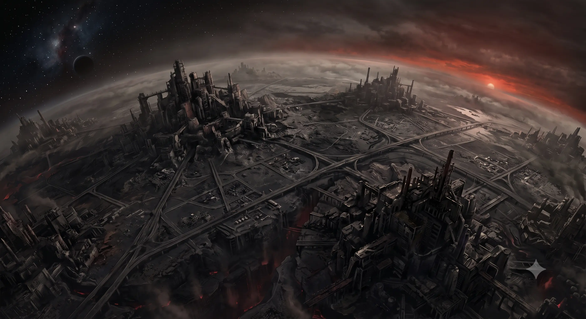
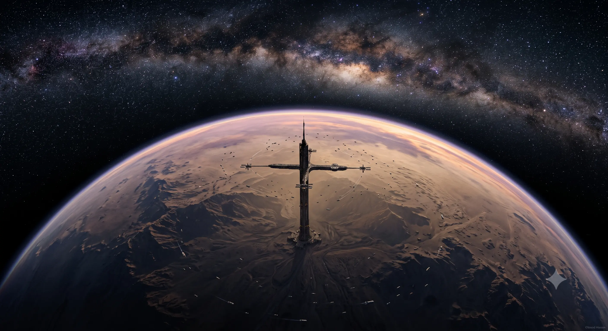
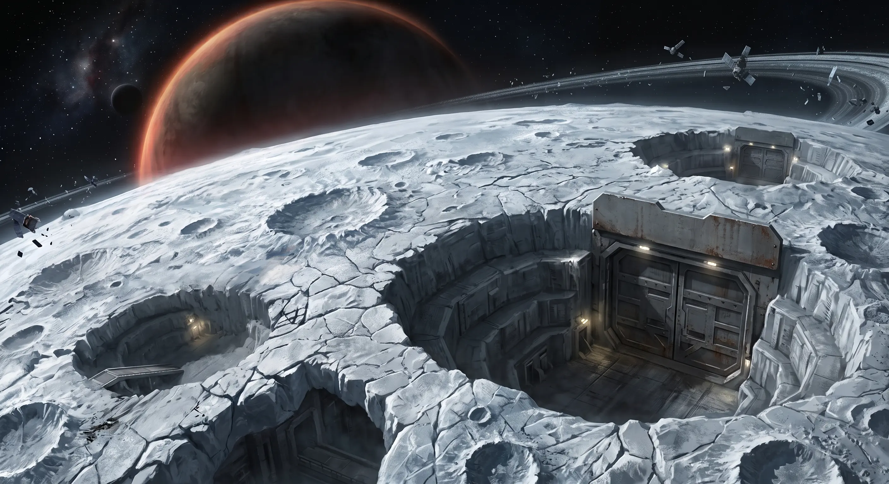
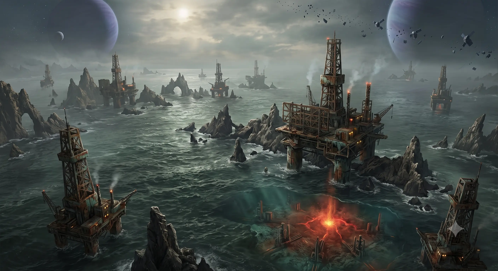
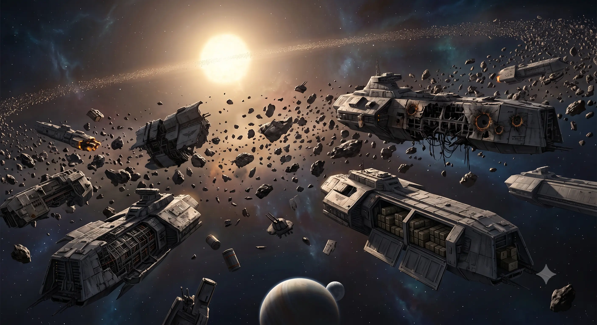

# Sistema Caleyat

## ⚠ Clasificación: RESTRINGIDO

**Designación:** Sistema Caleyat — Segmentum Obscurus, sector sin designar
**Población:** Desconocida (presuntamente evacuado)
**Estatus:** Zona de guerra abierta — toda nave que se aproxime será interrogada
**Último censo imperial:** No registrado

---

## Caleyat

> *Los hornos siguen calientes. Eso es lo que no entienden en Terra. Las factorías de Caleyat llevan siglos apagadas, pero cuando pusimos un pie en la superficie, los medidores de radiación temblaban como si los reactores llevaran encendidos ayer.*

— Fragmento de la transmisión del *Arcanum Ferrum*, primera nave en tomar órbita baja tras el redescubrimiento

**Clasificación:** Mundo industrial — colmena manufacturera
**Satélites:** Ninguno
**Atmósfera:** Respirable, con alta carga de partículas — uso de filtro obligatorio
**Gravedad:** 0,98 G

### Perfil del mundo

Caleyat es un planeta de superficie sólida cubierto por el caparazón de lo que fue una próspera civilización industrial. Los núcleos de las colmenas se alzan como montañas de acero y hormigón, sus fachadas negras por milenios de hollín inerte. Entre ellas se extienden llanuras de escoria y ceniza donde las carreteras de transporte aún dibujan la geometría de un imperio desaparecido.

Los generadores de plasma, apagados, emiten aún un débil rumor térmico. Nadie sabe por qué.

La luz solar apenas perfora la capa de smog fosilizado. El cielo es un gris perpetuo, rojizo al atardecer, como si el planeta mismo sangrara por sus mil heridas de chimenea.

### Historia

No hay registros de cuándo fue fundado Caleyat. Los archivos locales, saqueados o degradados, no ofrecen fechas. Lo que se sabe es fragmentario: Caleyat fue un mundo industrial menor del Imperio, especializado en la producción de componentes para vehículos de combate. Durante siglos, sus factorías alimentaron flotas enteras.

Luego, el silencio.

Los astrópatas dejaron de recibir señales. Las naves mercantes que se adentraron en el sistema no regresaron. El Imperio, ocupado en guerras mayores, dio el sistema por perdido y lo borró de los mapas navegables.

Mil años pasaron. O dos mil. O cinco. El tiempo no significa nada en la oscuridad.

Cuando la primera expedición de redescubrimiento atravesó la disformidad hacia Caleyat, encontraron el sistema vacío. Las colmenas, intactas. Las fábricas, silenciosas. Los habitantes, desaparecidos.

No había señales de batalla. No había cadáveres. No había nada.

Solo los hornos, aún calientes.

### Ascensor Orbital

El Ascensor Orbital de Caleyat es una estructura colosal de más de cinco kilómetros de altura que se alza desde la llanura de escoria hasta una estación de transferencia en órbita baja. Construido durante la época dorada del sistema, fue diseñado para mover mercancías y tropas entre la superficie y las naves en órbita sin necesidad de costosos despegues atmosféricos.

La torre está formada por una superestructura de acero y cerámica, atravesada por conductos de plasma, tuberías de combustible y cables de datos gruesos como el torso de un Space Marine. En su interior, docenas de niveles albergan plataformas de carga, puestos de control, cuartos de maquinaria y baterías de generadores de emergencia.

Cuando el sistema cayó en silencio, el ascensor quedó detenido a medio camino entre la superficie y el vacío. Las compuertas de seguridad se sellaron. Los sistemas de soporte vital se apagaron en algunos niveles y en otros siguen funcionando, alimentados por generadores que nadie recuerda haber encendido.

Hoy, el Ascensor Orbital es la puerta de entrada al planeta. Controlarlo significa controlar el flujo de refuerzos y suministros. Quien lo posea tendrá la llave de Caleyat.

---

## Sanpolium

> *El hielo lo guarda todo. Lo preserva. Bajo las capas de Sanpolium duerme la memoria de todo un sistema. Y la memoria, en las manos equivocadas, puede ser un arma más letal que un cañón de plasma.*

— Archimandrita Varnica, Ordo Scriptorum, antes de su desaparición en Sanpolium

**Clasificación:** Luna helada — archivo administrativo imperial
**Órbita:** Tercer cuerpo del sistema, orbitando un gigante gaseoso sin nombre
**Atmósfera:** Tenue, dióxido de carbono — respiración asistida necesaria
**Temperatura superficial:** −87 °C media

### Perfil

Sanpolium es una luna cubierta por una costra de hielo de kilómetros de espesor. Bajo el hielo, redes de túneles conectan antiguas cámaras acorazadas donde el Imperio almacenaba registros, censos, planos de construcción y correspondencia administrativa de todo el sector.

La superficie es un desierto de hielo picado por cráteres de impacto. Las únicas estructuras visibles son las cúpulas de entrada a los archivos subterráneos, selladas herméticamente. La mayoría fueron violadas durante el redescubrimiento. Algunas permanecen cerradas, sus cerraduras mecánicas desafían la tecnología actual.

### Los Archivos del Hielo

Lo que contiene Sanpolium es el sueño de todo Adepto Mechanicus: almacenes de conocimiento del antiguo Imperio, posiblemente incluyendo **Plantillas de Construcción Estándar** (PCE) o fragmentos de las mismas. No hay confirmación oficial. Varias expediciones mecanizadas han penetrado en los niveles superiores y regresado con documentos administrativos, mapas estelares obsoletos y manifiestos de carga. Los niveles inferiores permanecen inexplorados.

Se rumorea que el acceso a ciertas cámaras requiere claves genéticas o grados de autorización que se perdieron con la desaparición de los gobernantes del sistema.

### Historia

Sanpolium fue el corazón administrativo del sistema. Allí residía el gobernante de Caleyat, en un palacio ahora sepultado bajo el hielo. Desde sus cámaras acorazadas se administraban los impuestos, los censos de población y las rutas comerciales.

Cuando el sistema cayó en silencio, Sanpolium fue sellado desde el interior. Las puertas de los archivos se cerraron. Los sistemas de soporte vital se apagaron. El hielo, con el tiempo, borró toda huella de la entrada.

Los primeros exploradores encontraron la luna exactamente así: fría, hermética, intacta.

---

## Canetum

> *Cuando rompimos la superficie del océano, las criaturas salieron a nuestro encuentro. No eran hostiles. Nos observaban. Y en sus ojos había una inteligencia que no debería existir en un mundo sin Historia Imperial.*

— Diario de a bordo de la *Esperanza de Caleyat*, misión de sondeo oceánico

**Clasificación:** Mundo oceánico — explotación minera
**Órbita:** Cuarto cuerpo del sistema
**Atmósfera:** Respirable, alta humedad
**Composición:** 97 % agua líquida, 3 % archipiélagos rocosos

### Perfil

Canetum es un mundo cubierto casi en su totalidad por un océano salado de tonos verdes y grises. La superficie está salpicada de archipiélagos rocosos que emergen como espinas de una bestia sumergida. Sobre ellos, y sobre la propia superficie del océano, se alzan las plataformas mineras del antiguo Imperio: torres de metal carcomidas por la sal y el tiempo, algunas aún operativas.

Bajo las aguas, yacen yacimientos de minerales raros que el Imperio explotó durante siglos. Las plataformas de extracción funcionaban de forma automatizada, alimentadas por generadores geotérmicos que aún laten en el lecho marino.

### Astillero orbital

En órbita baja permanece los restos de un astillero imperial de tamaño medio. Sus grilletes de atraque cuelgan vacíos. Los cascos de media docena de naves a medio construir se oxidan lentamente, iluminados por la estrella del sistema. El astillero fue saqueado durante el redescubrimiento, pero sus núcleos de datos y sistemas de navegación podrían contener información valiosa.

### Vida nativa

El océano de Canetum alberga formas de vida autóctonas: criaturas bioluminiscentes, cardúmenes de organismos filtradores del tamaño de naves de desembarco y, en las fosas abisales, depredadores que ningún miembro de la Expedición ha logrado identificar. Los informes iniciales describen patrones de comportamiento que sugieren una inteligencia rudimentaria, tal vez incluso organización social.

La presencia de vida inteligente en Canetum no está confirmada. Pero los exploradores que pasan demasiado tiempo en el océano hablan de cantos.

---

## Cinturón de Pineda

> *Aquí yace la flota que nunca llegó a partir.*

— Inscripción en una viga del casco del *Orgullo de Caleyat*, acorazado de clase Retribution, destruido en el Cinturón

**Clasificación:** Cinturón de asteroides — cementerio naval
**Extensión:** 2,4 UA entre la órbita de Canetum y el límite del sistema

### Perfil

El Cinturón de Pineda es lo que queda de un planeta que nunca llegó a formarse, o que fue destruido en algún momento remoto de la historia del sistema. Millones de fragmentos rocosos y metálicos orbitan la estrella en una banda densa y traicionera.

Entre los asteroides, los restos de una flota imperial yacen dispersos. Fragatas partidas por la mitad, destructores con los cascos abiertos, transportes con las bodegas aún llenas de suministros. Algunas naves muestran impactos de proyectiles. Otras parecen haber sido desmanteladas metódicamente. Otras, sencillamente, flotan intactas, sin tripulación, sin daños, sin explicación.

### Estaciones de vigilancia

En los límites del cinturón, tres estaciones de vigilancia imperiales permanecen operativas en modo autónomo. Sus sensores siguen escaneando el vacío, enviando señales a un receptor que nadie contesta desde hace milenios. Dos de ellas fueron ocupadas por fuerzas de reconocimiento. La tercera, la estación *Pineda-X*, dejó de responder tras el primer contacto.

Nadie sabe qué encontraron allí.

---

## Vorago

> *No es un dios. No es un demonio. Es un fragmento de algo que existía antes de que el concepto de "dios" tuviera sentido. Los necrones lo llamaban arma. Los antiguos lo llamaban hambre. Nosotros lo hemos despertado.*

— Magos Biologis Varn, nota marginal en un informe geológico

**Clasificación:** Fragmento de C'tan — arma biológica necrona
**Estado:** Contención parcial — filtrando influencia psíquica
**Localización:** Corteza profunda de Caleyat, bajo el sector manufacturero

### Perfil

Vorago es un fragmento de un C'tan menor, capturado y reconfigurado por los necrones durante la Guerra en el Cielo. Su propósito original era funcionar como un arma de aniquilación planetaria: lanzado sobre un mundo habitado, emitía un campo de influencia psíquica que inducía paranoia, violencia y autodestrucción en toda forma de vida consciente. Los defensores se masacraban entre sí antes de que los ejércitos necrones hubieran de pisar la superficie.

El fragmento fue lanzado sobre Caleyat para eliminar a los Ancestrales que ocupaban el sistema. La operación fue un éxito. Pero antes de que los necrones pudieran recuperar el fragmento, la Gran Dormición los reclamó. Vorago quedó sepultado, su cápsula de contención enterrada bajo kilómetros de roca.

Los milenios pasaron. El Imperio colonizó Caleyat sin saber lo que yacía bajo sus factorías. Y la cápsula, lentamente, empezó a degradarse.

### El Silencio

Cuando la contención falló por primera vez, la población del sistema sintió el efecto de Vorago sin comprenderlo. Las disputas se volvieron mortales. Las guarniciones se rebelaron contra sus oficiales. Las familias se despedazaron entre sí. En cuestión de semanas, el sistema entero colapsó en una espiral de violencia imposible de detener.

Los pocos supervivientes huyeron. Los archivos de Sanpolium registraron la verdad y fueron sellados por orden del Gobernador. Su última transmisión —"Que el Emperador nos proteja de lo que hemos desenterrado"— fue también la última palabra del sistema Caleyat.

Vorago volvió a dormir. Pero no del todo.

Hoy, con el redescubrimiento y la guerra, Vorago se alimenta de nuevo. Cada muerte en la campaña lo fortalece. Su campo de influencia crece. Y aunque ninguna facción sabe aún de su existencia, todas sienten el susurro.

### El Legado de Varn

El Magos Biologis Varn era el responsable de la supervisión geológica y biológica del sistema Caleyat en los años previos al Silencio. Fue él quien, estudiando anomalías sísmicas bajo las factorías, encontró la cápsula de contención. Fue él quien entendió lo que era.

Varn no compartió su descubrimiento por los canales oficiales. Sabía que el pánico sería peor que la amenaza. En su lugar, volcó todos sus datos —lecturas, hipótesis, advertencias— en los **archivos de inventario de las factorías**, camuflados como registros de producción y mantenimiento. Allí, pensó, nadie los buscaría. Y si alguien los encontraba, sería alguien con suficiente criterio para entenderlos.

Varn murió durante el Silencio, como casi todos. Sus restos nunca fueron identificados. Pero sus datos sobrevivieron, dormidos en los cogitadores de las factorías, esperando a ser descubiertos.

---

## Cronología

| Evento | Tiempo |
|---|---|
| Fundación del sistema | Desconocido — anterior a los registros actuales |
| Época de actividad industrial | Siglos de producción continua |
| Silencio | Desconocido — el sistema dejó de comunicarse sin causa registrada |
| Redescubrimiento | Reciente — primera expedición imperial encuentra el sistema vacío |
| Guerra actual | Presente |

---

## Fragmentos recuperados

> *"…y que el Gobernador ha ordenado el cierre de los archivos de Sanpolium por motivos que no pueden ser discutidos en la frecuencia abierta. Repito: no pueden ser discutidos. Que el Emperador nos proteja de lo que hemos desenterrado."*

— Última transmisión registrada del Administratum en Sanpolium. Fecha ilegible.

> *"Las factorías de Caleyat están produciendo. No sabemos para quién. No sabemos desde cuándo. Pero están produciendo. Repito: las factorías están operativas. No hay personal. No hay supervisión. Las máquinas trabajan solas."*

— Transmisión de la fuerza de reconocimiento *Martillo de la Verdad*, interrumpida.

> *"El patrón de muerte no es aleatorio. La entidad —llamémosla Vorago, del gótico antiguo, 'el que devora'— no mata directamente. Induce. Las víctimas se matan entre sí. Los informes de Sanpolium hablan de guarniciones enteras volviéndose unas contra otras en cuestión de horas. No hay patógeno. No hay posesión disforme. Es un campo, como la gravedad. Un campo que empuja a la violencia.*
>
> *"Fragmento de C'tan. Estoy seguro. Los necrones lo lanzaron aquí para eliminar a los Antiguos. Y funcionó. El problema es que la cápsula de contención se está degradando. Vorago está despierto. Tiene hambre.*
>
> *"Y nosotros seguimos matando."*
>
> — Última entrada del diario de datos del Magos Biologis Varn, hallada siglos después en los archivos de inventario de las factorías de Caleyat. El informe se interrumpe abruptamente.
